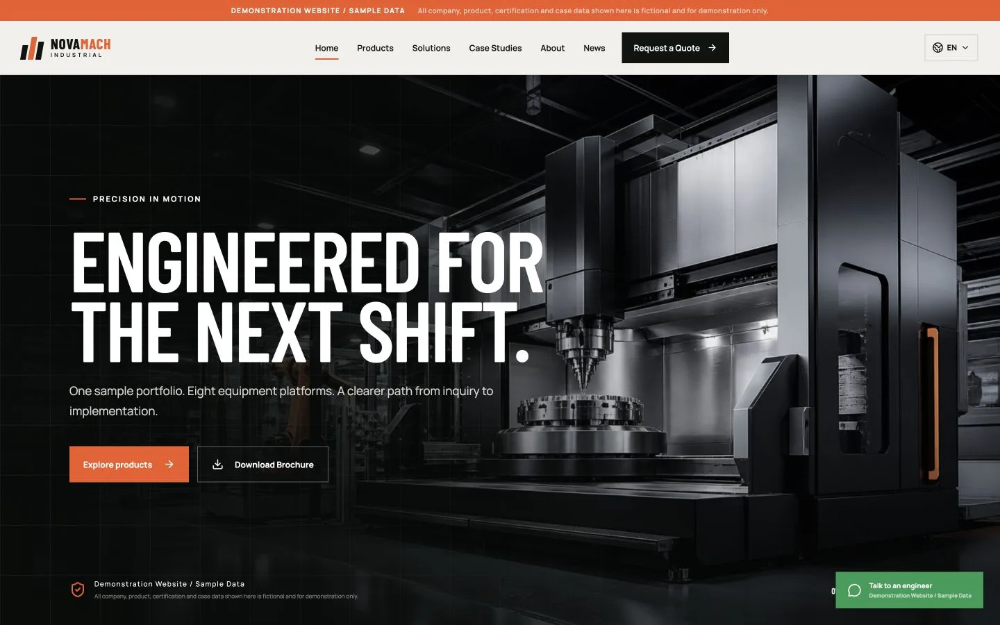

# NovaMach Industrial — B2B 外贸多语言独立站 Demo

**LIVE_DEMO / FICTIONAL BRAND** · [Try the Vercel site](https://0-1-b2b-demo-demo-novamach.vercel.app/) · [Case study](docs/case-study.md) · [Resume bullets](docs/resume-bullets.md) · [Interview notes](docs/interview-notes.md)



NovaMach is a fictional brand. This repository is a self-built demonstration project using sample data.

**Live Demo:** <https://0-1-b2b-demo-demo-novamach.vercel.app/> · Code commit `01f9eeb` · rebuilt 2026-09-23 on the existing Vercel project. The current production alias was checked against the rebuilt asset names, seven direct routes, canonical/OG URLs, robots, desktop/mobile layout, language selection and a synthetic RFQ-to-admin round trip. This is a fictional product demo, not a customer site.

> **Demonstration Website / Sample Data**
>
> 这是一个虚构品牌的产品演示项目。网站中的公司、产品、参数、认证、客户、案例、联系方式和业务数据均为模拟内容，不构成真实声明。

一个可直接用于渠道客户演示的 React + TypeScript + Vite 工业 B2B 独立站。视觉方向为“精密制造编辑部”：石墨黑、矿物灰、警示橙，大型工业排版与技术图纸网格。

This public repository contains only the fictional product demo. Internal
delivery notes, channel material, customer-specific copy, deployment records,
and local build output are intentionally excluded.

## 快速开始

要求：Node.js 20+，pnpm 9+。

```bash
pnpm install
pnpm dev
```

生产验证与预览：

```bash
pnpm lint
pnpm typecheck
pnpm build
pnpm preview
```

## 路由

- `/` — Home
- `/products` — 产品中心与分类筛选
- `/products/:slug` — 8 个产品详情页
- `/solutions` — 行业解决方案
- `/cases` — 明确标注为虚构的案例场景
- `/about` — 关于虚构品牌与内容原则
- `/news` — 3 篇模拟文章
- `/contact` — RFQ 询盘表单
- `/brochure` — 可打印 / Save as PDF 的两页演示手册
- `/capability-card` — 客户可直接转发的《外贸独立站能力卡》
- `/customer-deck` — 3 页客户介绍 / 打印页面
- `/admin-demo` — 专业演示后台（始终 `noindex,nofollow`）

## 已完成功能

- 高质量工业 Hero、Featured Products、Industry Solutions、Why Choose Us、Global Markets、Case Studies、Quality、CTA
- 8 个带独立图片视区、参数、应用、特点、询盘入口的模拟产品
- English / 简体中文 / Español 三语真实切换并在本地持久化
- Desktop / Tablet / Mobile 完整响应式布局和移动导航
- 产品分类筛选、产品详情关联推荐、WhatsApp 风格咨询入口
- RFQ 必填校验、URL 产品预选、文件入口、本地保存与后台询盘闭环
- 新闻列表、Brochure 下载入口、页面级 SEO Title / Description
- 默认整站 `noindex,nofollow`、不含后台的 `sitemap.xml`、Vercel/Netlify SPA 回退规则
- 客户能力卡 HTML、高清 PNG 与 3 页客户版 PDF / 打印页面
- `/admin-demo`：Dashboard、Products、Inquiries、Articles、SEO Settings；支持 localStorage 演示 CRUD 与 Reset Demo Data
- 全站顶部、Hero、页脚、案例、表单与后台均有 Demo / Sample Data 说明

## 仅演示 / 未接入

- RFQ 仅保存在当前浏览器 localStorage，不会发送到服务器；生产项目需接入邮件、CRM、数据库或 Serverless API
- WhatsApp 入口当前进入站内 RFQ；需替换为已确认的企业号码
- 后台产品、询盘、文章与 SEO 支持本地演示操作，但不含登录、权限或数据库
- Brochure 支持浏览器 Print / Save as PDF，正式版应由客户审核内容后输出
- 图片为 AI 生成的无品牌工业视觉，不代表真实工厂或设备
- 参数、案例指标、响应时效均为模拟值，正式使用前必须由企业审核
- 当前使用清晰的 Demo fallback 域名；部署时通过 `VITE_SITE_URL` 配置正式预览域名
- 虚构品牌 Demo 默认禁止搜索引擎索引；只有替换为经人工核验的真实企业内容后才可设置 `VITE_ALLOW_INDEXING=true`

## Demo 账号

无需登录。直接访问 `/admin-demo`。界面显示的 `Demo Manager / demo@novamach.example` 仅为模拟身份与不可投递示例地址。

## 推荐截图页面

1. 首页桌面首屏（1440 × 900）：Hero、免责声明、语言切换与 RFQ CTA
2. 首页产品与解决方案区（1440 × 1000）：产品图谱和系统化表达
3. `/products`（1440 × 1000）：8 产品矩阵与分类筛选
4. `/products/nx-500-five-axis`（1440 × 1000）：产品视觉、参数、特点与 RFQ
5. `/contact?product=lf-3015-laser`（1440 × 1000）：产品预选的 RFQ 表单
6. `/admin-demo`（1440 × 900）：Dashboard
7. `/admin-demo` Products 模块（1440 × 900）：后台目录表格
8. 首页移动端（390 × 844）：响应式 Hero 与移动菜单
9. `/capability-card`（1080 × 1440）：微信客户能力卡

## 内容与代码结构

- `src/content.ts`：三语 UI、产品、方案、案例、文章模拟数据
- `src/App.tsx`：可复用页面组件、路由、表单、后台模块
- `src/styles.css`：设计系统、动画状态与三档响应式规则
- `public/assets/`：项目内工业视觉资产
- `public/sitemap.xml` / `robots.txt`：基础 SEO

More public engineering notes are in [`docs/`](docs/).

## 素材说明

素材使用内置图像生成能力生成后保存到项目内：

- `hero-factory.png`：无品牌五轴设备与机器人单元的石墨色智能工厂宽幅广告摄影；左侧留标题负空间；无人物、文字、标志、水印或旗帜。
- `product-sprite.png`：严格 4×2 网格、共 8 个无品牌工业设备的统一棚拍产品图；包含五轴加工、激光切割、焊接、折弯、空压、注塑、包装与 CMM；无文字、标志、水印或人物。

完整最终提示词见 `ASSET-PROMPTS.md`。

## 部署

详见 [DEPLOYMENT.md](./DEPLOYMENT.md)。

构建时会根据 `VITE_SITE_URL` 生成 `robots.txt` 和 `sitemap.xml`。NovaMach 是虚构 Demo，因此默认 `VITE_ALLOW_INDEXING=false`，整站禁止索引；`/admin-demo`、`/capability-card` 与 `/customer-deck` 即使在正式索引模式下也不会进入 sitemap。

## Public release boundary

This repository excludes the original internal sales kit and channel materials.
Its screenshots and examples use a fictional brand and sample data.
